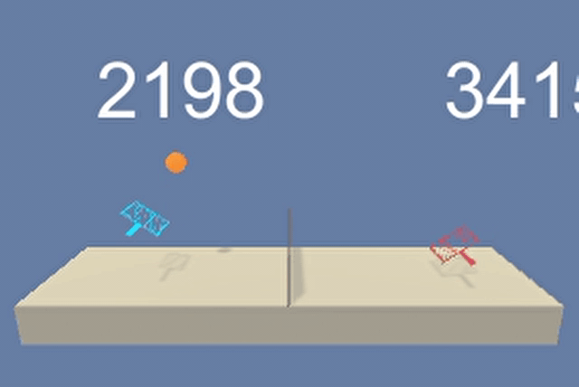

# Project 3: Collaboration and Competition - Deep Reinforcement Learning

## Project Details

---

- Two agents (players) playing a game similar to tennis in which the aim is to keep the ball as much as possible without falling into the table.
- **states**: The state space is comprised of 24 dimensions.
- **action_space**: 2 actions which the agent might decide in a continuous space.
- **goal**: The environment is considered solved if agents could keep the ball as much as possible without hitting the table. Target score is +0.5 over 100 consecutive episodes. Note that one hit over the net rewards +0.1

### Reinforcement Learning Algorithm

- The Algorithm is Deep Deterministic Policy Gradient  (DDPG)

- It relies on two deep learning networks (actor network and critic network)

- The critic network in this algorithm is like the dqn network but can handle continuous action values as it receives the output of the actor network which represents the chosen action.

- Whereas the actor network is trained to output the best action `μ(s; θ)` for a given state. Unlike typical actor-critic algorithm in which the actor outputs the policy `π(a | s; θ)`, where
  - `s`: state
  - `θ`: model parameters
  - `a`: action

- The Neural Network model is softly updated to a target model in order to keep the learning stable

## Getting Started

---

- Clone this repo

```bash
git clone https://github.com/beber89/DeepRL-udaproj3-collaboration-and-competition
```

- Install python dependencies pytorch, matplotlib & unityagents

```bash
pip install torch matplotlib unityagents
```

- Download the unity environment
  - Linux: [click here](https://s3-us-west-1.amazonaws.com/udacity-drlnd/P3/Tennis/Tennis_Linux.zip)
  - Mac OSX: [click here](https://s3-us-west-1.amazonaws.com/udacity-drlnd/P3/Tennis/Tennis.app.zip)
  - Windows (32-bit): [click here](https://s3-us-west-1.amazonaws.com/udacity-drlnd/P3/Tennis/Tennis_Windows_x86.zip)
  - Windows (64-bit): [click here](https://s3-us-west-1.amazonaws.com/udacity-drlnd/P3/Tennis/Tennis_Windows_x86_64.zip)

## Instructions

---

### Training

- Open `Tennis.ipynb`

- Navigate the notebook until you reach the `3. Watch agent` section and click on that cell

- Click `Cell` in the menu bar then click `Run All Above`

- Wait until the agent finishes training

### Run Trained Agent

- Open `Tennis.ipynb`

- Navigate the notebook until you reach the `1. Training` section and click on that cell

- Click `Cell` in the menu bar then click `Run All Above`

- Navigate the notebook until you reach the `3. Watch agent` section and click on that cell

- Click `Cell` in the menu bar then click `Run All Below`

- This loads the weights into the model from files `checkpoint_actor.pth` and `checkpoint_critic.pth`

- A unity window pops up showing the agent playing the game


